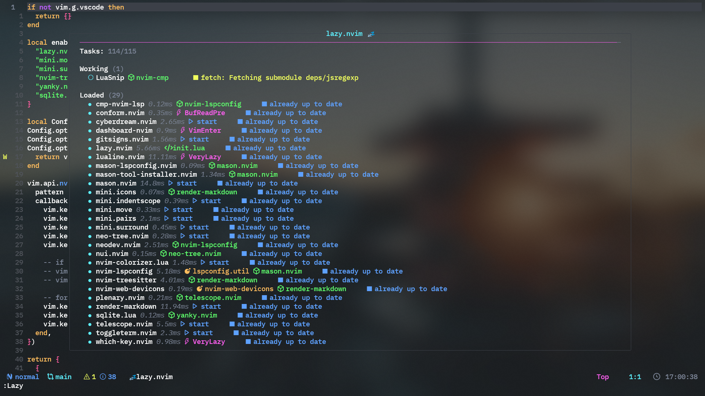
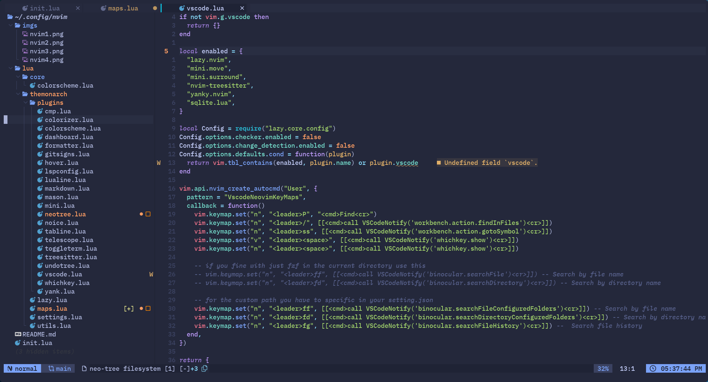
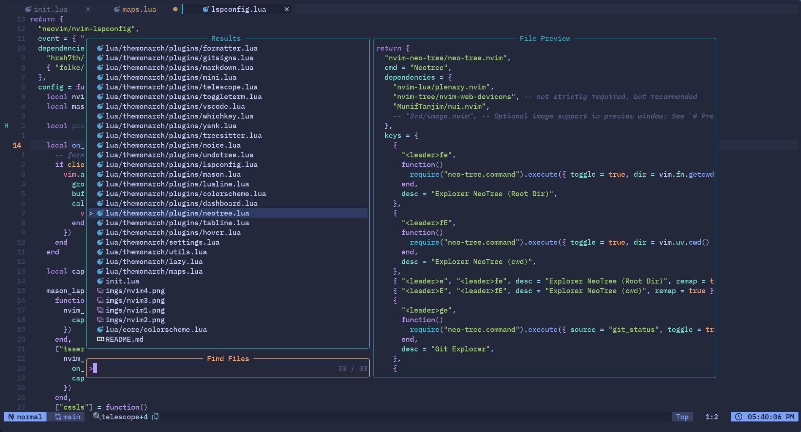

<table>
  <tr>
    <td></td>
    <td></td>
  </tr>
  <tr>
    <td></td>
    <td></td>
  </tr>
</table>

## This is my config for neovim

> [!NOTE]
> You can use this config with vscode-neovim extension
